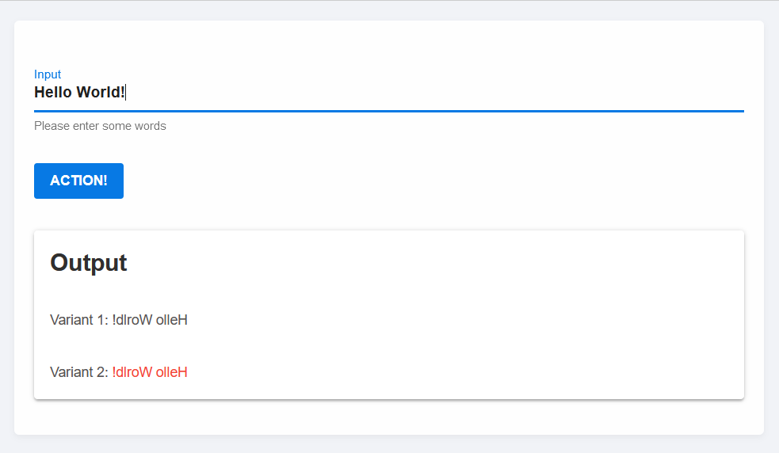

# StippleUI [](https://www.genieframework.com/docs/)

StippleUI is a library of reactive UI elements for [Stipple.jl](https://github.com/GenieFramework/Stipple.jl).

`StippleUI.jl`, together with [Stipple.jl](https://github.com/GenieFramework/Stipple.jl),
[StippleCharts.jl](https://github.com/GenieFramework/StippleCharts.jl) and
[Genie.jl](https://github.com/GenieFramework/Genie.jl) provide a powerful and complete solution for building
beautiful, responsive, reactive, high performance interactive data dashboards in pure Julia.

`StippleUI` provides over 30 UI elements, including forms and form inputs (button, slider, checkbox, radio, toggle, range), lists, data tables,
higher level components (badges, banners, cards, dialogs, chips, icons), and layout elements (row, col, dashboard, heading, space) from the [Quasar Framework](https://quasar.dev).

## Installation

```julia
pkg> add StippleUI
```
## Usage

### Quasar Components

StippleUI defines functions for most of the quasar vue components. Most functions are named like their Quasar counterparts, e.g. `btn()` for `q-btn`, `tab()` for `q-tab`, etc. Some functions have received different names for clarity, e.g. `textfield()` for `q-input` with text type and `numberfield()` for `q-input` with number type.
Most functions have named positional arguments that are used for definition of common attributes, e.g. `label` or `fieldname`.
Besides that all functions have a general calling scheme for unnamed arguments and keyword arguments:

- if a component supports content, the first non-named positional argument is passed as content to the components.
- any following non-array argument is passed as parameter to the components
- any non-named array argument is joined and passed as content
- if a component does not support content, e.g. `btn()`, all non-named arguments except arrays are passed as parameter. (Passing arrays can be used to define templates for a component. More details can be found in Vue.js docs.)
- keyword arguments are passed pretty much the same as the Julia expression, except that
    - `__` is converted to `-`
    - `!` in the middle of a keyword is converted to `.`
    - `!` at the end of a keyword indicates that the argument should be treated as js expression
    - a Symbol as value of a keyword argument indicates that the argument should be treated as js expression
    - non-standard characters which are not allowed in Julia variable names can be used by employing the `var""`notation, e.g. `span(var"v-html" = "My Text with <br>new lines")`
    - most variable names that contain a dash in Vue-syntax are automatically replaced, e.g. `"leftlabel" => "left-label"`. All standard mappings can be found in `StippleUI.API.ATTRIBUTES_MAPPINGS`


#### Examples
```julia
julia> btn("Just do it!", @click(:mybutton), loading = :mybutton) |> println
<q-btn :loading="mybutton" label="Just do it!" v-on:click="mybutton = true"></q-btn>

julia> textfield("Label", :mytext) |> println
<q-input label="Label" v-model="mytext"></q-input>

```
#### What if a component is missing?
If a quasar component is not yet covered by StippleUI, you can still use the `quasar()` function to make it available in your UI:

```julia
julia> quasar(:btn, label = "Action!") |> println
<q-btn label="Action!"></q-btn>
```
In a very similar way, you can also integrate vue components or any other html component:

```julia
julia> vue(:calender, date = "today", "This is still a dream!")
"<vue-calender date=\"today\">This is still a dream!</vue-calender>"

julia> xelem(:br)
"<br></br>"
```

### Bindings
There are two ways of assigning component properties
- assignment of a string value:
 `attribute = "lorem ipsum"`
- assignment of a Javascript expression, by
  - assigning a `Symbol`
    `attribute = :input`
  - or by appending a `!`-character to the attribute
    `attribute! = "input"`
  
  In most cases this syntax is used to directly bind app variables, but you can also bind more complicated expressions, e.g. array elements (note that js has 0-based indexing):
 `attribute = Symbol("data[0]")`
 `attribute = R"data[0]"`
 `attribute! = "data[0]"`
 The `R""` string macro is a convenient way of defining Symbols.
### Helper macros

Vue.js has defined several short cuts which typically start with a `@`-character. In Julia the `@`-character is reserved for macros. So we decided to use macros to achieve a similar syntax. But we also provide macros to add attributes with other 'forbidden' characters like `.` or `-`.
Have a look at the docstrings of `@click`, `@on`,  `@iif`, `@els`, `@elsiif`, `@recur`, `@text`, `@bind`, `@data` and `@showif` to learn more. To try out whether rendering is correct enter the tentative expression at the REPL, e.g.
```julia
julia> span(@showif(true))
"<span v-show=\"true\"></span>"

julia> span(@click(:mybutton))
"<span v-on:click=\"mybutton = true\"></span>"
```

### Javascript code

Vue.js offers the possibility of embedding javascript functions that are called ither manually (`methods`) or automatically when certain events occur, e.g. `watch`, `mounted`, `created`, `computed`. Such code can easily be defined by the respective macros `@methods`, `@watch`, `@mounted`, `@created`, `@computed`, e.g.


```julia
@methods """
logdemo: function(text) {
    console.log("Text from Stipple: " + text)
    return text
},
squaredemo: function(number) {
    console.log("The square of " + number + " is " + number**2)
    return number**2
}
"""

@created """"
    console.log('This app has just been created!')
"""
```
See the [editable tree demo](https://github.com/GenieFramework/StippleDemos/blob/master/ReactiveTools%20API/EditableTree.jl) for more information.
These macros also work for explicit models, e.g.
```julia
@created MyApp """"
    console.log('This app has just been created!')
"""
```
### User-defined events
There is support for user-defined events by the macro `@event`.
```julia
@event :uploaded begin            
    println("Files have been uploaded!")
end
```
These lines define julia code that is executed when an event from the client is forwarded to the server.
Typically, events at the client originate from certain vue components, e.g. `q-uploader`. They can be forwarded by calling the `@on` macro
with two Symbol arguments.

```julia
julia> uploader("Upload files", url = "/upload" , @on(:uploaded, :uploaded))
"<q-uploader url=\"/upload\" v-on:uploaded=\"function(event) { handle_event(event, 'uploaded') }\">Upload files</q-uploader>"
```
Events can also be triggered manually by calling `handle_event(event, 'uploaded')` on the client side.

See the [file upload demo](https://github.com/GenieFramework/StippleDemos/blob/master/ReactiveTools%20API/FileUpload.jl) for more information.
Again the `@event` macro also works for explicit models, e.g.
```julia
@event MyApp :uploaded begin            
    println("Files have been uploaded to MyApp!")
end
```
## Example app

The following snippet illustrates how to build a reactive UI based on StippleUI. You find three different ways of triggering handlers.
- Every input in the input field triggers a function that sets the inverted input string in the output field.
- Hitting the `Enter` key in the input field inverts the output string.
- Pressing of the action button inverts the output string.
StippleUI 
```julia
using Stipple, StippleUI

@vars Inverter begin
  process = false
  input = ""
  output::String, READONLY
end

function handlers(model)
  on(model.input) do input
      model.output[] = input |> reverse
  end

  onbutton(model.process) do
      model.output[] = model.output[] |> reverse
  end

  model
end

function ui()
  row(cell(class = "st-module", [
    textfield(class = "q-my-md", "Input", :input, hint = "Please enter some words", @on("keyup.enter", "process = true"))

    btn(class = "q-my-md", "Action!", @click(:process), color = "primary")
    
    card(class = "q-my-md", [
      card_section(h2("Output"))
      card_section("Variant 1: {{ output }}")
      card_section(["Variant 2: ", span(class = "text-red", @text(:output))])
    ])
  ]))
end

route("/") do
  model = Inverter |> init |> handlers
  page(model, ui()) |> html
end

Genie.isrunning(:webserver) || up()
```


## Demos
### StippleDemos
We have dedicated a Github Page to Stipple Demos with many downloadable examples at:
<https://github.com/GenieFramework/StippleDemos>
(Not all of them are updated to the latest changes of the API yet. But most of them should be functional.)
### German Credits visualisation dashboard


The full application is available at:
<https://github.com/GenieFramework/Stipple-Demo-GermanCredits>

### Iris Flowers dataset k-Means clustering dashboard


The full application is available at:
<https://github.com/GenieFramework/Stipple-Demo-IrisClustering>

### More information

While Stipple/StippleUI documentation is still evolving, you can find help and many small examples via docstrings of the functions.

```julia
help?> btn
search: btn Btn btngroup btndropdown q__btn q__btn__group q__btn__dropdown button Buttons onbutton SubString @onbutton bitstring

  Stipple has a component called btn which is a button with a few extra useful features. For instance, it comes in two shapes:
  rectangle (default) and round. It also has the material ripple effect baked in (which can be disabled).

  The button component also comes with a spinner or loading effect. You would use this for times when app execution may cause a      
  delay and you want to give the user some feedback about that delay. When used, the button will display a spinning animation as     
  soon as the user clicks the button.

  When not disabled or spinning, btn emits a @click event, as soon as it is clicked or tapped.

  Examples
  ≡≡≡≡≡≡≡≡≡≡

  julia> btn("Move Left", color = "primary", icon = "mail", @click("press_btn = true"))

  julia> btn("Go to Hello World", color = "red", type = "a", href = "hello", icon = "map", iconright = "send")

  julia> btn("Connect to server!", color="green", textcolor="black", @click("btnConnect=!btnConnect"), [
            tooltip(contentclass="bg-indigo", contentstyle="font-size: 16px",
            style="offset: 10px 10px",  "Ports bounded to sockets!")]
         )

  ─────────────────────────────────────────────────────────────────────────────────────────────────────────────────────────────────  

  Arguments
  ≡≡≡≡≡≡≡≡≡≡≡

  ─────────────────────────────────────────────────────────────────────────────────────────────────────────────────────────────────  

    1. Behavior
       • loading::Bool - Put button into loading state (displays a spinner – can be overridden by using a 'loading'
       slot)
       • percentage::Union{Int, Float64} - Percentage (0.0 < x < 100.0); To be used along 'loading' prop; Display a
       progress bar on the background ex. 23
       • darkpercentage::Bool - Progress bar on the background should have dark color; To be used along with
       'percentage' and 'loading' props

    2. Content
       • label::Union{String, Int} - The text that will be shown on the button ex. Button Label
       • icon::String - Icon name following Quasar convention; Make sure you have the icon library installed unless
       you are using 'img:' prefix; If 'none' (String) is used as value then no icon is rendered (but screen real
       estate will still be used for it) ex. map ion-add img:https://cdn.quasar.dev/logo/svg/quasar-logo.svg
       img:path/to/some_image.png
       • iconright::String - Icon name following Quasar convention; Make sure you have the icon library installed
       unless you are using 'img:' prefix; If 'none' (String) is used as value then no icon is rendered (but screen
       real estate will still be used for it) ex. map ion-add img:https://cdn.quasar.dev/logo/svg/quasar-logo.svg
       img:path/to/some_image.png
       • nocaps::Bool - Avoid turning label text into caps (which happens by default)
       • nowrap::Bool - Avoid label text wrapping
       • align::String - Label or content alignment default. center accepted values. left right center around between
       evenly
       • stack::Bool - Stack icon and label vertically instead of on same line (like it is by default)
       • stretch::Bool - When used on flexbox parent, button will stretch to parent's height

    3. General
       • type::String - 1) Define the button native type attribute (submit, reset, button) or 2) render component with
       <a> tag so you can access events even if disable or 3) Use 'href' prop and specify 'type' as a media tag
       default. button ex. a submit reset button image/png href="https://some-site.net" target="_blank"
       • tabindex::Union{Int, String} - Tabindex HTML attribute value

    4. Navigation
       • href::String - Native <a> link href attribute; Has priority over the 'to' and 'replace' props ex.
       https://quasar.dev href="https://quasar.dev" target="_blank"
       • target::String - Native <a> link target attribute; Use it only with 'to' or 'href' props ex. _blank _self
       _parent _top

    5. State
       • loading::Bool - Put button into loading state (displays a spinner – can be overridden by using a 'loading'
       slot)
       • padding::String - Apply custom padding (vertical [horizontal]); Size in CSS units, including unit name or
       standard size name (none|xs|sm|md|lg|xl); Also removes the min width and height when set
       • color::String - Color name for component from the Color Palette (https://quasar.dev/style/color-palette) eg.
       primary teal-10
       • textcolor::String - Overrides text color (if needed); Color name from the Color Palette
       (https://quasar.dev/style/color-palette) eg. primary teal-10
       • dense::Bool - Dense mode; occupies less space
       • round::Bool - Makes a circle shaped button
```

## Acknowledgements

StippleUI builds upon the excellent [Quasar Vue components](https://quasar.dev/vue-components) and the underlying [Vue.js](https://vuejs.org) Javascript framework.